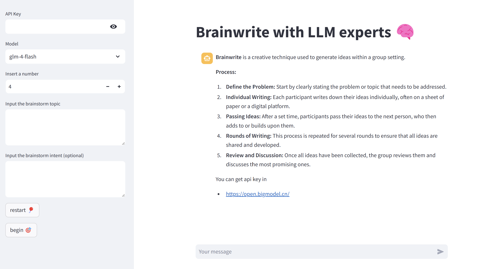

# Brainwrite with LLM experts 🧠

**Brainwrite** is a creative technique used to generate ideas within a group setting. 

**Process:**
1. **Define the Problem:** Start by clearly stating the problem or topic that needs to be addressed.
2. **Individual Writing:** Each participant writes down their ideas individually, often on a sheet of paper or a digital platform.
3. **Passing Ideas:** After a set time, participants pass their ideas to the next person, who then adds to or builds upon them.
4. **Rounds of Writing:** This process is repeated for several rounds to ensure that all ideas are shared and developed.
5. **Review and Discussion:** Once all ideas have been collected, the group reviews them and discusses the most promising ones.

You can get api key in 
- [https://open.bigmodel.cn/](https://open.bigmodel.cn/)

## Project profile

The project consists of three parts
- Code to help LLMs generate ideas
- Human-AI interaction platform code
- Some necessary data in the game

### environment
- openai == 1.45.0 
- streamlit == 1.40.0 

### File introduction
- main.py: human-AI interaction platform code run with streamlit
- brainwrite_cothinker.py: code used in brainwrite and cothinker
- data : some necessary data in the game
- package: some code used to call api

## demo

## contact
- Email: ysh020603@yeah.net, yangsenhao2024@ia.ac.cn
- A Postgraduate in CASIA, UCAS
